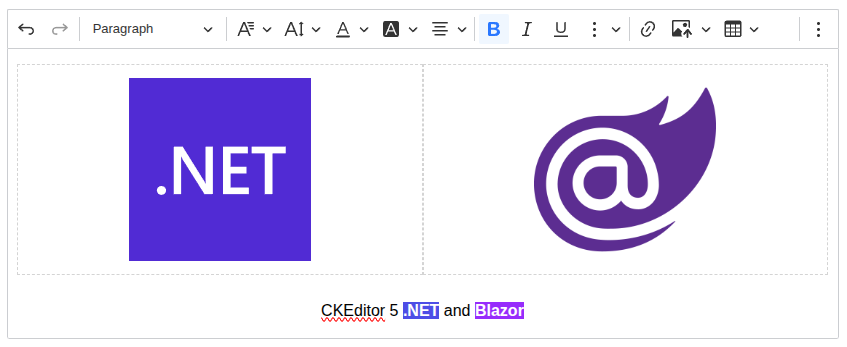

# ckeditor5-blazor

The fastest way to add CKEditor 5 to your Blazor app. Zero-config installation, native C# data binding, and no manual JS Interop.

> [!IMPORTANT]
> This integration is unofficial and not maintained by CKSource. For official CKEditor 5 documentation, visit [ckeditor.com](https://ckeditor.com/docs/ckeditor5/latest/). If you encounter any issues in editor, please report them on the [GitHub repository](https://github.com/ckeditor/ckeditor5/issues).

<!-- markdownlint-disable MD033 -->

  

## Under construction 🚧

This project is currently under active development. In the meantime the author might be watching cat videos, brewing coffee, and negotiating with npm packages - PRs and snacks are welcome. Here's a silly cat+coffee picture for motivation:

## Psst... 👀

If you're looking for similar stuff, check these out:

- [ckeditor5-phoenix](https://github.com/Mati365/ckeditor5-phoenix)
  Seamless CKEditor 5 integration for Phoenix Framework. Plug & play support for LiveView forms with dynamic content, localization, and custom builds.

- [ckeditor5-rails](https://github.com/Mati365/ckeditor5-rails)
  Smooth CKEditor 5 integration for Ruby on Rails. Works with standard forms, Turbo, and Hotwire. Easy setup, custom builds, and localization support.

- [ckeditor5-symfony](https://github.com/Mati365/ckeditor5-symfony)
  Native CKEditor 5 integration for Symfony. Works with Symfony 6.x+, standard forms and Twig. Supports custom builds, multiple editor configurations, asset management, and localization. Designed to be simple, predictable, and framework-native.

- [ckeditor5-livewire](https://github.com/Mati365/ckeditor5-livewire)
  CKEditor 5 integration for Laravel Livewire. Real-time syncing, custom builds, localization, and easy setup.

## Trademarks 📜

CKEditor® is a trademark of [CKSource Holding sp. z o.o.](https://cksource.com/) All rights reserved. For more information about the license of CKEditor® please visit [CKEditor's licensing page](https://ckeditor.com/legal/ckeditor-oss-license/).

This package is not owned by CKSource and does not use the CKEditor® trademark for commercial purposes. It should not be associated with or considered an official CKSource product.

## License 📜

This project is licensed under the terms of the [MIT LICENSE](LICENSE).

This project injects CKEditor 5 which is licensed under the terms of [GNU General Public License Version 2 or later](https://www.gnu.org/licenses/old-licenses/gpl-2.0.html). For more information about CKEditor 5 licensing, please see their [official documentation](https://ckeditor.com/legal/ckeditor-oss-license/).
