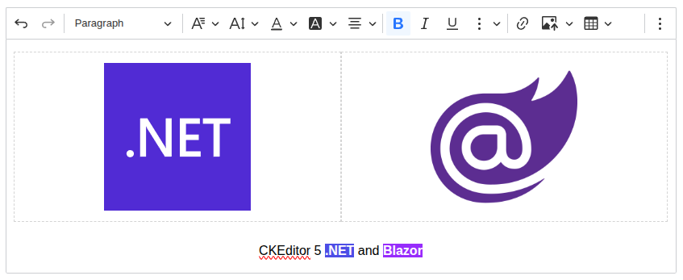
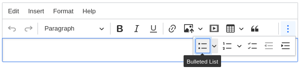
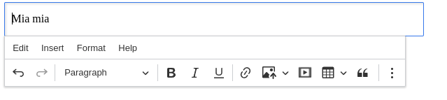
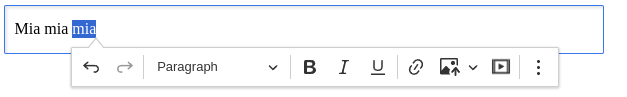
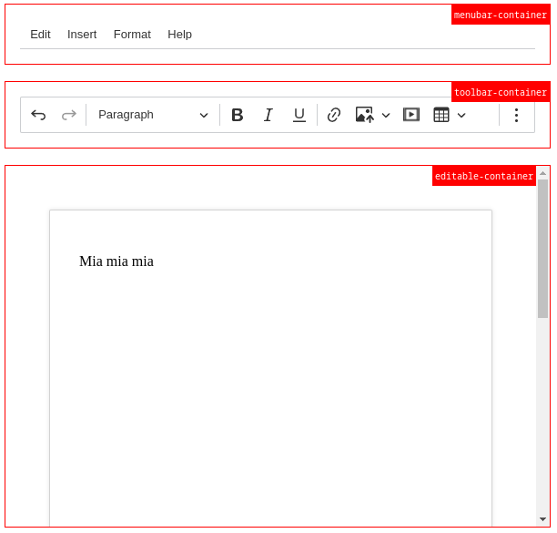
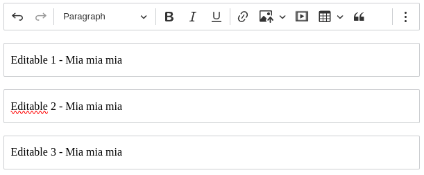
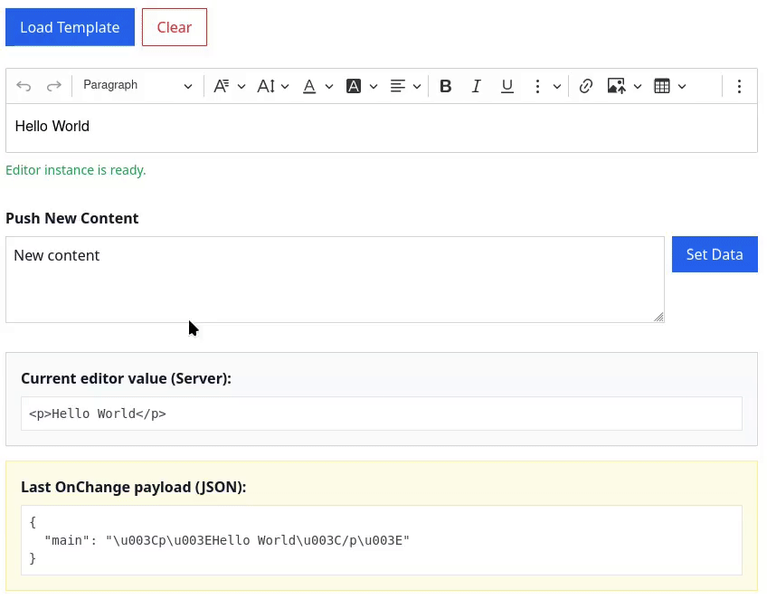
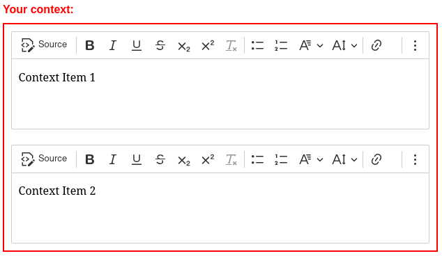
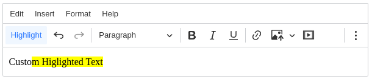

# ckeditor5-blazor

[](LICENSE)
[](http://makeapullrequest.com)

[](https://github.com/Mati365/ckeditor5-blazor/issues)
[](https://app.codecov.io/gh/Mati365/ckeditor5-blazor/tree/main/npm_package%2Fsrc)
[](https://app.codecov.io/gh/Mati365/ckeditor5-blazor/tree/main/src)
[](https://www.npmjs.com/package/ckeditor5-blazor)
[](https://www.nuget.org/packages/CKEditor.Blazor/)

CKEditor 5 for Blazor - a lightweight multiplatform WYSIWYG editor integration for ASP.NET Core Blazor Server and WebAssembly. It works with Razor components and .NET forms. Easy to set up, it supports self-hosted assets, CDN loading, multiple editor types, shared contexts, localization, and custom plugins.

> [!IMPORTANT]
> This integration is unofficial and not maintained by CKSource. For official CKEditor 5 documentation, visit [ckeditor.com](https://ckeditor.com/docs/ckeditor5/latest/). If you encounter any issues in editor, please report them on the [GitHub repository](https://github.com/ckeditor/ckeditor5/issues).

<!-- markdownlint-disable MD033 -->
<p align="center">
  
</p>

## Table of Contents

- [ckeditor5-blazor](#ckeditor5-blazor)
  - [Table of Contents](#table-of-contents)
  - [Installation 🚀](#installation-)
    - [🔗 Compatibility](#-compatibility)
    - [🏠 Self-hosted via MSBuild](#-self-hosted-via-msbuild)
    - [📡 CDN Distribution](#-cdn-distribution)
  - [Basic Usage 🏁](#basic-usage-)
    - [Simple Editor ✏️](#simple-editor-️)
      - [All available parameters 📋](#all-available-parameters-)
    - [Static rendering with `Interactive=true` 🧱](#static-rendering-with-interactivetrue-)
  - [Configuration ⚙️](#configuration-️)
    - [Override default preset configuration 🧑‍💻](#override-default-preset-configuration-)
    - [Define your configuration directly in the view 💻](#define-your-configuration-directly-in-the-view-)
    - [Preset DSL 🛠️](#preset-dsl-️)
    - [Define reusable configuration presets 🧩](#define-reusable-configuration-presets-)
    - [Dynamic presets 🎯](#dynamic-presets-)
    - [Element references using `$element` 🎯](#element-references-using-element-)
  - [Providing the License Key 🗝️](#providing-the-license-key-️)
  - [Localization 🌍](#localization-)
    - [Translation Loading 🌐](#translation-loading-)
    - [Global Translation Config 🛠️](#global-translation-config-️)
    - [Custom translations 🌐](#custom-translations-)
    - [Translation references using `$translation` ✨](#translation-references-using-translation-)
  - [Editor Types 🖊️](#editor-types-️)
    - [Classic editor 📝](#classic-editor-)
    - [Inline editor 📝](#inline-editor-)
    - [Balloon editor 🎈](#balloon-editor-)
    - [Decoupled editor 🌐](#decoupled-editor-)
    - [Multiroot editor 🌳](#multiroot-editor-)
    - [Paragraph-like editing 📄](#paragraph-like-editing-)
      - [Classic / Balloon / Inline editor](#classic--balloon--inline-editor)
      - [Decoupled editor](#decoupled-editor)
      - [Multiroot editor](#multiroot-editor)
  - [Advanced configuration ⚙️](#advanced-configuration-️)
    - [Blazor Data Binding 🔄](#blazor-data-binding-)
      - [Two way binding using `@bind-Value` ⛓️](#two-way-binding-using-bind-value-️)
        - [Multiroot Editables 🌳⛓️](#multiroot-editables-️)
      - [Bidirectional Communication using Events 🔄](#bidirectional-communication-using-events-)
        - [Editor → .NET: Content Change Event 📤](#editor--net-content-change-event-)
        - [.NET → Editor: Set Content 📥](#net--editor-set-content-)
    - [Editor Ready Event ✅](#editor-ready-event-)
    - [Focus Tracking 👁️](#focus-tracking-️)
    - [Root Attributes 🏷️](#root-attributes-️)
    - [Image Upload 🖼️](#image-upload-️)
    - [Watchdog 🐶](#watchdog-)
      - [Configuring the watchdog ⚙️](#configuring-the-watchdog-️)
      - [Disabling the watchdog 🚫](#disabling-the-watchdog-)
    - [Splitting Assets: Global Import Map with Per-page Styles 🗺️](#splitting-assets-global-import-map-with-per-page-styles-️)
      - [Self-hosted variant 🏠](#self-hosted-variant-)
      - [CDN variant 📡](#cdn-variant-)
      - [Disabling module preload hints ⏳](#disabling-module-preload-hints-)
  - [Context 🤝](#context-)
    - [Basic usage 🔧](#basic-usage--1)
    - [Custom context config 🌐](#custom-context-config-)
    - [Context config DSL 🛠️](#context-config-dsl-️)
  - [Custom plugins 🧩](#custom-plugins-)
    - [Import from a JS module 📦](#import-from-a-js-module-)
    - [Register in a JS bundle 🗂️](#register-in-a-js-bundle-️)
  - [Editors and Contexts registry 👀](#editors-and-contexts-registry-)
  - [Development ⚙️](#development-️)
    - [Running Tests 🧪](#running-tests-)
      - [Running E2E tests 🧪](#running-e2e-tests-)
  - [Psst... 👀](#psst-)
  - [Trademarks 📜](#trademarks-)
  - [License 📜](#license-)

## Installation 🚀

Choose between two installation methods based on your needs. Both approaches provide the same editor API in Razor, but differ in how CKEditor 5 assets are loaded and managed.

### 🔗 Compatibility

| CKEditor 5 Version | Integration Version |
|--------------------|---------------------|
| 43.x – 47.x        | `<= 1.10.x`         |
| >= 48.0            | `>= 1.11.x`         |

### 🏠 Self-hosted via MSBuild

Bundle CKEditor 5 with your application for full control over assets, versioning, and offline support. During build, the package downloads required assets automatically.

**Complete setup:**

1. **Add NuGet dependency:**

   ```bash
   dotnet add package CKEditor.Blazor
   ```

2. **(Optional) Override MSBuild asset options** in your `.csproj`:

   ```xml
   <PropertyGroup>
     <CKEditorVersion>48.2.0</CKEditorVersion>
     <CKEditorIncludePremiumAssets>false</CKEditorIncludePremiumAssets>
     <CKBoxVersion>2.8.0</CKBoxVersion>
     <CKBoxIncludeAssets>true</CKBoxIncludeAssets>
     <CKEditorAssetsOutputPath>$(MSBuildProjectDirectory)/wwwroot</CKEditorAssetsOutputPath>
     <CKEditorNpmRegistryUrl>https://registry.npmjs.org</CKEditorNpmRegistryUrl>
   </PropertyGroup>
   ```

3. **Register CKEditor services** in `Program.cs`:

   ```csharp
   using CKEditor.Blazor.Services;

   builder.Services.AddCKEditor();
   ```

   By default the package infers the correct asset URL from build metadata, so no extra configuration is needed for the typical setup.

   If your static files are served from a non-standard base path (e.g. behind a reverse proxy with a path prefix, or assets placed in a subdirectory), you can adjust the base paths:

   ```csharp
   using CKEditor.Blazor.Model.SelfHosted;
   using CKEditor.Blazor.Services;

   builder.Services.AddCKEditor(options => options
       .ExtendDefaultPreset(preset => preset
            .WithSelfHosted(new SelfHostedConfig
            {
                AssetsBasePath = "/static/ckeditor",
                IntegrationBasePath = "/custom/_content/CKEditor.Blazor"
            })));
   ```

   - `AssetsBasePath` applies to the bundled CKEditor 5 assets directory (editor scripts, stylesheets, translations).
   - `IntegrationBasePath` applies to the internal Blazor integration script (default: `/_content/CKEditor.Blazor`).

   Both values should be specified without a trailing slash and must match what the browser actually uses to fetch the files.

4. **Build your project** to download and prepare assets:

   ```bash
   dotnet build
   ```

5. **Add self-hosted assets component** in `<head>` (e.g. `App.razor`):

   ```razor
   @using CKEditor.Blazor.Components.Assets

   <HeadContent>
       <CKE5Assets />
   </HeadContent>
   ```

6. **Use editor components** anywhere in your Razor UI:

   ```razor
   @using CKEditor.Blazor.Components

   <CKE5Editor Value="@("<p>Hello world!</p>")" />
   ```

### 📡 CDN Distribution

Load CKEditor 5 from CKSource CDN using import maps. This method avoids local asset downloads and is good for quick setup.

**Complete setup:**

1. **Add NuGet dependency:**

   ```bash
   dotnet add package CKEditor.Blazor
   ```

2. **(Optional) Override MSBuild asset options** in your `.csproj`:

   ```xml
   <PropertyGroup>
     <CKEditorIncludeAssets>false</CKEditorIncludeAssets>
     <CKEditorIncludePremiumAssets>false</CKEditorIncludePremiumAssets>
     <CKBoxIncludeAssets>false</CKBoxIncludeAssets>
   </PropertyGroup>
   ```

3. **Build your project** to download and prepare assets:

   ```bash
   dotnet build
   ```

4. **Register CKEditor with cloud preset** in `Program.cs`:

   ```csharp
   using CKEditor.Blazor.Model.Cloud;
   using CKEditor.Blazor.Services;

   builder.Services.AddCKEditor(options => options
        .SetLicenseKey("your-license-key-here")
        .ExtendDefaultPreset(preset => preset
            .WithCloud(new CloudConfig
            {
                EditorVersion = "48.2.0",
                Premium = false
            })));
   ```

   If your app is served from a non-standard base path (e.g. behind a reverse proxy), you can customize the path to the internal Blazor integration script by setting `IntegrationBasePath` (default: `/_content/CKEditor.Blazor`). Because this setup uses a CDN, there is no `AssetsBasePath` parameter since the CKEditor 5 assets are loaded externally.

5. **Add cloud assets component** in `<head>`:

   ```razor
   @using CKEditor.Blazor.Components.Assets
   @using CKEditor.Blazor.Model.License

   <HeadContent>
       <CKE5Assets Distribution="DistributionChannel.Cloud" />
   </HeadContent>
   ```

6. **Use editor components** anywhere in your Razor UI:

   ```razor
   @using CKEditor.Blazor.Components

   <CKE5Editor Value="@("<p>Hello world!</p>")" />
   ```

That's it! 🎉

## Basic Usage 🏁

Get started with the most common usage pattern. This example shows how to render an editor in Razor and keep content synced with .NET state.

### Simple Editor ✏️

Create a basic editor with default toolbar and plugins.

```razor
@using CKEditor.Blazor.Components
@using CKEditor.Blazor.Model

<CKE5Editor
    EditorType="EditorType.Classic"
    EditableHeight="300"
    @bind-Value="content" />

@code {
    private EditorValue content = "<p>Initial content</p>";
}
```

`EditorValue` can be initialized from a plain string (mapped to the `main` root) or from a `Dictionary<string, string>` for multi-root editors, where each key is a root name:

```razor
@using CKEditor.Blazor.Components
@using CKEditor.Blazor.Model

<CKE5Editor
    EditorType="EditorType.Multiroot"
    @bind-Value="content" />

@code {
    private EditorValue content = new Dictionary<string, string>
    {
        ["header"] = "<p>Header content</p>",
        ["main"]   = "<p>Main content</p>",
        ["footer"] = "<p>Footer content</p>"
    };
}
```

#### All available parameters 📋

All parameters accepted by `<CKE5Editor>` with short inline comments. Copy and remove what you don't need.

<details>
<summary>Expand code snippet</summary>

```razor
@using CKEditor.Blazor.Components
@using CKEditor.Blazor.Model
@using CKEditor.Blazor.Model.Events
@using Microsoft.JSInterop

<CKE5Editor
    @* --- Content --- *@
    @bind-Value="content"
    OnChange="HandleChange"

    @* --- Identity & Appearance --- *@
    Id="my-editor"
    Class="my-editor-class"
    Style="display:block;width:100%"
    EditableHeight="300"

    @* --- Editor Type & Configuration --- *@
    EditorType="EditorType.Classic"
    Preset="default"
    Config="editorConfig"
    MergeConfig="editorMergeConfig"

    @* --- Root model element (use "$inlineRoot" for paragraph-like editing) --- *@
    RootModelElement="$root"

    @* --- Localization --- *@
    Language="en"
    CustomTranslations="editorTranslations"

    @* --- Forms & Context --- *@
    Name="body"
    Required="true"
    ContextId="shared-context"

    @* --- Behavior & Performance --- *@
    SaveDebounceMs="300"
    Watchdog="true"
    Interactive="false"
    RootAttributes="editorRootAttributes"

    @* --- Lifecycle Events --- *@
    OnReady="HandleReady"
    OnFocus="HandleFocus"
    OnBlur="HandleBlur"
    OnImageUpload="HandleImageUpload"
/>

@code {
    private EditorValue content = "<p>Hello world!</p>";

    // Shallow-replaces the default configuration
    private Dictionary<string, object> editorConfig = new()
    {
        ["plugins"] = new[] { "Essentials", "Paragraph", "Bold", "Italic", "Undo" },
        ["toolbar"] = new Dictionary<string, object>
        {
            ["items"] = new[] { "bold", "italic", "|", "undo", "redo" }
        }
    };

    // Deep-merges with the default configuration
    private Dictionary<string, object> editorMergeConfig = new()
    {
        ["menuBar"] = new Dictionary<string, object> { ["isVisible"] = true }
    };

    // UI text overrides for specific languages
    private EditorTranslations editorTranslations = new()
    {
        ["en"] = new Dictionary<string, string> { ["Bold"] = "Strong" }
    };

    // ARIA / data-* attributes for the main editable element
    private EditorRootAttributes editorRootAttributes = new()
    {
        ["aria-label"] = "Article body",
        ["data-testid"] = "editor-root"
    };

    private async Task HandleChange(CKE5EditorChangeEventArgs args)
    {
        Console.WriteLine($"Content changed: {args.Value}");
        await Task.CompletedTask;
    }

    private async Task HandleReady(IJSObjectReference editor)
    {
        Console.WriteLine("Editor ready");
        await Task.CompletedTask;
    }

    private async Task HandleFocus(IJSObjectReference editor)
    {
        Console.WriteLine("Editor focused");
        await Task.CompletedTask;
    }

    private async Task HandleBlur(IJSObjectReference editor)
    {
        Console.WriteLine("Editor blurred");
        await Task.CompletedTask;
    }

    private async Task<string?> HandleImageUpload(CKE5ImageUploadEventArgs args)
    {
        // Upload args.Data (Base64) to your server/storage here
        // Return the public image URL, or 'null' to reject the upload.
        return $"https://cdn.example.com/images/{args.FileName}";
    }
}
```

</details>

> [!TIP]
> You rarely need every parameter at once. Most editors only need `@bind-Value` and optionally `EditorType`, `EditableHeight`, and `Preset`. All other parameters have sensible defaults.

### Static rendering with `Interactive=true` 🧱

By default, components initialize through Blazor .NET interop callbacks.
If your page is rendered in a non-interactive/static mode, those callbacks are not available.

Set `Interactive="true"` to let CKEditor web components bootstrap directly in the browser without .NET interop initialization:

```razor
@using CKEditor.Blazor.Model

<CKE5Editor
    EditorType="EditorType.Classic"
    Interactive="true"
    Value="@("<p>Static page content</p>")" />
```

This is useful when rendering static pages where you still want the editor UI to initialize on the client.

## Configuration ⚙️

You can configure editor presets in `AddCKEditor(...)`. The default preset is `default`. Presets are reusable configuration objects that can be applied to any editor instance. You can also define custom presets and override the default one.

### Override default preset configuration 🧑‍💻

You can pass initial content and merge additional configuration. In the scenario below, the `MergeConfig` will extend the `default` preset configuration to make the menu bar visible. It's only shallow merge, so nested arrays will be replaced, not merged.

```razor
<CKE5Editor
    Value="<p>This is the initial content of the editor.</p>"
    MergeConfig="@(new Dictionary<string, object>
    {
        ["menuBar"] = new Dictionary<string, object>
        {
            ["isVisible"] = true
        }
    })" />
```

Alternatively, you can extend the default configuration directly in `Program.cs` when registering services:

```csharp
builder.Services.AddCKEditor(options =>
    options.ExtendDefaultPreset(preset => preset
        .WithMergedConfig(new Dictionary<string, object>
        {
            ["menuBar"] = new Dictionary<string, object>
            {
                ["isVisible"] = true
            }
        })));
```

### Define your configuration directly in the view 💻

Override the default configuration with custom plugins and toolbar items.

```razor
<CKE5Editor
    Language="@("pl")"
    Config="@(new Dictionary<string, object>
    {
        ["plugins"] = new[] { "Essentials", "Paragraph", "Bold", "Italic", "Link", "Undo" },
        ["toolbar"] = new Dictionary<string, object>
        {
            ["items"] = new[] { "bold", "italic", "link", "|", "undo", "redo" }
        }
    })" />
```

In order to specify the `UI` and `Content` language separately, use the `Language` object:

```razor
@using CKEditor.Blazor.Model

<CKE5Editor Language="@(new Language { UI = "pl", Content = "en" })" />
```

### Preset DSL 🛠️

If you prefer strongly typed, fluent configuration over raw dictionaries, build presets with `PresetConfig` and register them through `CKEditorOptions`:

```csharp
using CKEditor.Blazor.Model;
using CKEditor.Blazor.Services;

builder.Services.AddCKEditor(options => options
    .SetLicenseKey("GPL")
    .AddDefaultPreset(preset => preset
        .WithEditorType(EditorType.Classic)
        .WithPlugins("Essentials", "Paragraph", "Bold", "Italic", "Undo")
        .WithToolbar("bold", "italic", Toolbar.Separator, "undo", "redo")
        .WithLanguage("pl")
        .WithCustomTranslations("pl", new Dictionary<string, string>
        {
            ["Bold"] = "Pogrubienie"
        })));
```

### Define reusable configuration presets 🧩

In order to override the default preset or add custom presets, use the fluent `AddPreset` helper:

```csharp
using CKEditor.Blazor.Model;
using CKEditor.Blazor.Services;

builder.Services.AddCKEditor(options => options
    .AddPreset("minimal", preset => preset
        .WithEditorType(EditorType.Classic)
        .WithPlugins("Essentials", "Paragraph", "Bold", "Italic", "Undo")
        .WithToolbar("bold", "italic", Toolbar.Separator, "undo", "redo")));
```

Use it in Razor:

```razor
<CKE5Editor Preset="@("minimal")" Value="<p>Simple editor</p>" />
```

### Dynamic presets 🎯

You can also create dynamic presets that can be modified at runtime:

```razor
@using CKEditor.Blazor.Model
@using CKEditor.Blazor.Services

<CKE5Editor Preset="@dynamicPreset" Value="<p>Runtime preset</p>" />

@code {
    private readonly PresetConfig dynamicPreset = ConfigManager.CreateDefaultPreset()
        .WithToolbar("bold", "italic", "link", Toolbar.Separator, "undo", "redo");
}
```

### Element references using `$element` 🎯

Use `PresetConfig.ElementSelector` anywhere in your editor configuration where CKEditor expects an `HTMLElement`:

```csharp
using CKEditor.Blazor.Model;
using CKEditor.Blazor.Services;

builder.Services.AddCKEditor(options => options
    .ExtendDefaultPreset(preset => preset
        .WithConfigEntry("myPlugin", new Dictionary<string, object>
        {
            ["container"] = PresetConfig.ElementSelector("#my-container")
        })));
```

## Providing the License Key 🗝️

CKEditor 5 requires a license key for official CDN and premium features.

1. **Environment variable** (recommended for production):

   ```bash
   export CKEditor__DefaultLicenseKey="your-license-key-here"
   ```

2. **Programmatic config** in `Program.cs`:

   ```csharp
   builder.Services.AddCKEditor(options => options
       .SetLicenseKey("your-license-key-here"));
   ```

If you use CKEditor 5 under GPL, use `GPL` as your key value.

## Localization 🌍

Support multiple languages in the editor UI and content.

### Translation Loading 🌐

For self-hosted setups, translation assets are handled by your bundler automatically. For cloud setups, translations are loaded through the configured CDN bundle. In both cases, set the UI language per editor or context:

```razor
<CKE5Editor
    Language="@("pl")"
    Value="<p>Treść z polskim UI</p>" />
@* or *@
<CKE5Editor
    Language="@(new Language { UI = "pl", Content = "en" })"
    Value="<p>Polish UI, English content</p>" />
```

### Global Translation Config 🛠️

Set default language and translated labels in your preset configuration:

```csharp
builder.Services.AddCKEditor(options => options
    .ExtendDefaultPreset(preset => preset
        .WithLanguage("pl")
        .WithCustomTranslations("pl", new Dictionary<string, string>
        {
            ["Bold"] = "Pogrubienie",
            ["Italic"] = "Kursywa",
            ["Undo"] = "Cofnij",
            ["Redo"] = "Ponów"
        })));
```

### Custom translations 🌐

You can override translations per editor instance via `CustomTranslations`:

```razor
@using CKEditor.Blazor.Model

<CKE5Editor
    Value="<p>Custom labels</p>"
    CustomTranslations="@(new EditorTranslations
    {
        ["pl"] = new Dictionary<string, string>
        {
            ["Bold"] = "Pogrubienie (custom)"
        }
    })" />
```

### Translation references using `$translation` ✨

Use `PresetConfig.TranslationReference` in any part of your editor or context configuration:

```csharp
using CKEditor.Blazor.Model;
using CKEditor.Blazor.Services;

builder.Services.AddCKEditor(options => options
    .ExtendDefaultPreset(preset => preset
        .WithCustomTranslations("pl", new Dictionary<string, string>
        {
            ["Bold"] = "Pogrubienie"
        })
        .WithConfigEntry("myPlugin", new Dictionary<string, object>
        {
            ["buttonLabel"] = PresetConfig.TranslationReference("Bold")
        })));
```

## Editor Types 🖊️

CKEditor 5 for Blazor supports four distinct editor types, each designed for specific use cases. Choose the one that best fits your application's layout and functionality requirements.

### Classic editor 📝

Traditional WYSIWYG editor with a fixed toolbar above the editing area. Best for standard content editing scenarios like blog posts, articles, or forms.



```razor
@using CKEditor.Blazor.Model

<CKE5Editor
    EditorType="EditorType.Classic"
    Value="@("<p>This is the initial content of the editor.</p>")"
    EditableHeight="300" />
```

### Inline editor 📝

Minimalist editor that appears directly within content when clicked. Ideal for in-place editing scenarios where the editing interface should be invisible until needed.



```razor
@using CKEditor.Blazor.Model

<CKE5Editor
    EditorType="EditorType.Inline"
    Value="@("<p>Inline editor content</p>")"
    Class="border border-gray-300" />
```

> [!NOTE]
> Inline editors don't work with `<textarea>` elements and may not be suitable for traditional form scenarios.

### Balloon editor 🎈

Contextual editor that shows a floating toolbar near the selected text. Great for comment editing, annotations, or any scenario where a non-intrusive editing experience is desired.



```razor
@using CKEditor.Blazor.Model

<CKE5Editor
    EditorType="EditorType.Balloon"
    Value="<p>Balloon editor content</p>"
    Class="border border-gray-300" />
```

### Decoupled editor 🌐

Flexible editor where toolbar and editing area are completely separated. Provides maximum layout control for custom interfaces and complex applications.



```razor
@using CKEditor.Blazor.Model

<CKE5Editor EditorType="EditorType.Decoupled">
    <CKE5UIPart Name="toolbar" Class="mb-4" />
    <CKE5Editable
        RootName="main"
        Value="<p>This is the initial content of the decoupled editor editable.</p>"
        InnerClass="p-4" />
</CKE5Editor>
```

> [!NOTE]
> `EditorId` is passed down automatically to `CKE5Editable` and `CKE5UIPart` components via cascading parameters if they are placed inside the `<CKE5Editor>`. If placed outside, you must manually set `EditorId` on each of them to link them to the specific editor.

### Multiroot editor 🌳

Advanced editor supporting multiple separate editing areas (roots) with a shared toolbar. Perfect for complex documents with multiple editable sections like headers, sidebars, and main content.



You can set the content for all roots at once via the `<CKE5Editor>` component using a dictionary:

```razor
@using CKEditor.Blazor.Model

<CKE5Editor
    EditorType="EditorType.Multiroot"
    Value="@(new Dictionary<string, string>
    {
        ["header"]  = "<p>Header content</p>",
        ["content"] = "<p>Main content</p>",
        ["footer"]  = "<p>Footer content</p>"
    })">

    <CKE5UIPart Name="toolbar" Class="mb-4" />

    <CKE5Editable RootName="header" />
    <CKE5Editable RootName="content" />
    <CKE5Editable RootName="footer" />
</CKE5Editor>
```

Alternatively, provide `Value` or `@bind-Value` directly on each `CKE5Editable`:

```razor
@using CKEditor.Blazor.Model

<CKE5Editor EditorType="EditorType.Multiroot">
    <CKE5UIPart Name="toolbar" Class="mb-4" />

    <CKE5Editable RootName="header"  Value="<p>Header content</p>" />
    <CKE5Editable RootName="content" Value="<p>Main content</p>" />
    <CKE5Editable RootName="footer"  Value="<p>Footer content</p>" />
</CKE5Editor>
```

### Paragraph-like editing 📄

Paragraph-like editing mode restricts the editor's root to a single block element — by default a `<p>` — preventing users from inserting multiple top-level block elements (headings, lists, etc.). This is ideal for short-text fields such as article titles, captions, or descriptions: places where you want the richness of inline formatting (bold, italic, links) but a single-paragraph constraint.

The feature is enabled by setting `RootModelElement="$inlineRoot"` on the `CKE5Editor` or `CKE5Editable` component. This maps the CKEditor 5 model root to the `$inlineRoot` schema element, which allows only inline content.

> [!NOTE]
> Make sure your preset's toolbar and plugin list does not include block-level items (`Heading`, `List`, `BlockQuote`, etc.) when using `RootModelElement="$inlineRoot"`, as those commands require block-level schema support that is absent in inline roots.

#### Classic / Balloon / Inline editor

For single-root editor types, set `RootModelElement` directly on the `<CKE5Editor>` component. It maps the implicit `main` root to `$inlineRoot`:

```razor
@using CKEditor.Blazor.Components
@using CKEditor.Blazor.Model

@* Paragraph-like classic editor — single <p>, inline formatting only *@
<CKE5Editor
    Id="title-editor"
    EditorType="EditorType.Classic"
    RootModelElement="$inlineRoot"
    @bind-Value="title" />

@code {
    private EditorValue title = "<p>Article title goes here</p>";
}
```

The same parameter works with `EditorType.Balloon` and `EditorType.Inline`:

```razor
@using CKEditor.Blazor.Model

@* Paragraph-like balloon editor — ideal for image captions *@
<CKE5Editor
    EditorType="EditorType.Balloon"
    RootModelElement="$inlineRoot"
    @bind-Value="caption" />

@code {
    private EditorValue caption = "<p>Image caption</p>";
}
```

If you reuse the inline-text pattern in many places, define a dedicated preset without block-level plugins and reference it by name:

```csharp
// Program.cs
using CKEditor.Blazor.Model;
using CKEditor.Blazor.Services;

builder.Services.AddCKEditor(options => options
    .AddPreset("inline_text", preset => preset
        .WithEditorType(EditorType.Classic)
        .WithPlugins("Essentials", "Bold", "Italic", "Link")
        .WithToolbar("bold", "italic", "link")));
```

```razor
@* No need to repeat RootModelElement — just use the preset *@
<CKE5Editor
    Preset="@("inline_text")"
    RootModelElement="$inlineRoot"
    @bind-Value="title" />
```

#### Decoupled editor

For the decoupled editor, set `RootModelElement` on the `CKE5Editable` child component rather than on `CKE5Editor`:

```razor
@using CKEditor.Blazor.Model

<CKE5Editor EditorType="EditorType.Decoupled">
    <CKE5UIPart Name="toolbar" Class="mb-4" />

    @* Single editable in paragraph-like mode *@
    <CKE5Editable
        RootName="main"
        RootModelElement="$inlineRoot"
        @bind-Value="caption"
        InnerClass="p-2 border border-gray-300" />
</CKE5Editor>

@code {
    private string caption = "<p>Caption text here</p>";
}
```

#### Multiroot editor

In a multiroot setup each `CKE5Editable` can independently opt in to paragraph-like mode. Set `RootModelElement="$inlineRoot"` only on the roots that should be restricted; leave the others without it (they default to the standard `$root`):

```razor
@using CKEditor.Blazor.Model

<CKE5Editor EditorType="EditorType.Multiroot">
    <CKE5UIPart Name="toolbar" Class="mb-4" />

    @* Title root: paragraph-like, only inline content allowed *@
    <CKE5Editable
        RootName="title"
        RootModelElement="$inlineRoot"
        @bind-Value="title"
        Class="p-2 text-2xl font-bold border border-gray-300" />

    @* Lead root: paragraph-like, only inline content allowed *@
    <CKE5Editable
        RootName="lead"
        RootModelElement="$inlineRoot"
        @bind-Value="lead"
        Class="p-2 italic border border-gray-300" />

    @* Body root: normal editing, full block content allowed *@
    <CKE5Editable
        RootName="body"
        @bind-Value="body"
        Class="p-2 border border-gray-300" />
</CKE5Editor>

@code {
    private string title = "<p>Page Title</p>";
    private string lead  = "<p>Short introductory sentence.</p>";
    private string body  = "<p>Full article content with headings, lists, etc.</p>";

    private void Save()
    {
        // title and lead contain single-paragraph HTML only
        // body may contain full block-level HTML
    }
}
```

When the editor initialises, each root whose `RootModelElement` is set to `"$inlineRoot"` is registered with that model element name. You can verify this at runtime via the JavaScript `EditorsRegistry`:

```javascript
import { EditorsRegistry } from 'ckeditor5-blazor';

EditorsRegistry.the.waitFor('my-editor').then((editor) => {
  // '$inlineRoot' for restricted roots, '$root' for unrestricted ones
  console.log(editor.model.document.getRoot('title')?.name); // '$inlineRoot'
  console.log(editor.model.document.getRoot('lead')?.name);  // '$inlineRoot'
  console.log(editor.model.document.getRoot('body')?.name);  // '$root'
});
```

## Advanced configuration ⚙️

### Blazor Data Binding 🔄

Use native Blazor binding and callbacks for full client ⇄ server synchronization.



#### Two way binding using `@bind-Value` ⛓️

Bind editor content to your component state. The `SaveDebounceMs` parameter allows you to control the debounce delay for content updates.

```razor
<CKE5Editor
    @bind-Value="content"
    SaveDebounceMs="500" />

@code {
    private EditorValue content = "<p>Initial content</p>";
}
```

##### Multiroot Editables 🌳⛓️

For multiroot/decoupled layouts, you can bind each editable separately by placing `@bind-Value` on the individual `CKE5Editable` components.

```razor
<CKE5Editable RootName="header"  @bind-Value="header" />
<CKE5Editable RootName="content" @bind-Value="content" />

@code {
    private string header  = "<p>Header</p>";
    private string content = "<p>Main</p>";
}
```

> [!NOTE]
> `EditorId` is passed down automatically to `CKE5Editable` and `CKE5UIPart` components via cascading parameters if they are placed inside the `<CKE5Editor>`. If placed outside, you must manually set `EditorId` on each of them to link them to the specific editor.

#### Bidirectional Communication using Events 🔄

##### Editor → .NET: Content Change Event 📤

Observe content updates without replacing your binding logic:

```razor
<CKE5Editor
    @bind-Value="value"
    OnChange="OnEditorChange" />

@code {
    private EditorValue value = "<p>Hello</p>";

    private void OnEditorChange(CKE5EditorChangeEventArgs args)
    {
        Console.WriteLine(args.Value.Data["main"]);
    }
}
```

##### .NET → Editor: Set Content 📥

Update bound value from C# and editor content is pushed automatically:

```razor
<button @onclick="LoadTemplate">Load template</button>
<CKE5Editor @bind-Value="value" />

@code {
    private EditorValue value = "<p>Initial</p>";

    private void LoadTemplate()
        => value = "<h2>Work Report</h2><p>This is a template loaded from .NET.</p>";
}
```

### Editor Ready Event ✅

An event is fired when the editor has finished initializing and is fully ready.

```razor
@using Microsoft.JSInterop

<CKE5Editor OnReady="OnReady" />

@code {
    private void OnReady(IJSObjectReference editor)
    {
        Console.WriteLine("Editor is ready");
    }
}
```

### Focus Tracking 👁️

Track editor focus state using `OnFocus` and `OnBlur` events:

```razor
<CKE5Editor
    OnFocus="() => isFocused = true"
    OnBlur="() => isFocused = false" />

@code {
    private bool isFocused;
}
```

### Root Attributes 🏷️

`RootAttributes` lets you attach custom key-value pairs to the editor root model element. This is useful for storing metadata in roots, which can be accessed by custom plugins or used for testing and debugging purposes. For more details on root attributes in CKEditor 5, see the [official engine documentation](https://ckeditor.com/docs/ckeditor5/latest/framework/architecture/editing-engine.html). Long story short - they are not DOM / HTML attributes, but rather a dictionary of arbitrary data attached to the root element in the editor model.

Example of setting root attributes on a single-root editor:

```razor
@using CKEditor.Blazor.Model

<CKE5Editor
    Value="@("<p>Hello</p>")"
    RootAttributes="@(new EditorRootAttributes
    {
        ["custom-model-attribute"] = "my-value"
    })" />
```

In multiroot/decoupled layouts each `CKE5Editable` can carry its own set of root attributes:

```razor
@using CKEditor.Blazor.Model

<CKE5Editor EditorType="EditorType.Multiroot">
    <CKE5UIPart Name="toolbar" Class="mb-4" />

    <CKE5Editable
        RootName="header"
        Value="<p>Header</p>"
        RootAttributes="@(new EditorRootAttributes
        {
            ["custom-model-attribute"] = "header-root"
        })" />

    <CKE5Editable
        RootName="content"
        Value="<p>Main content</p>"
        RootAttributes="@(new EditorRootAttributes
        {
            ["custom-model-attribute"] = "content-root"
        })" />
</CKE5Editor>
```

> [!NOTE]
> `RootAttributes` serializes to JSON and is passed to the CKEditor 5 root via the `data-cke-root-attributes` HTML attribute. Empty dictionaries are treated as absent — no attribute is emitted.

### Image Upload 🖼️

The editor supports image uploads triggered by drag-and-drop, clipboard paste, or the toolbar image button.

Behavior depends on whether the `OnImageUpload` callback is set:

- **With `OnImageUpload`** - the file is encoded as Base64 and passed to your .NET handler. Your handler stores it wherever you like (disk, cloud, database) and returns the public URL to embed in the document.
- **Without `OnImageUpload`** - the editor falls back to embedding the image as a Base64 `data:` URI directly in the content. This is fine for quick prototyping but not recommended for production because it significantly inflates document size.

```razor
@using CKEditor.Blazor.Components
@using CKEditor.Blazor.Model
@using CKEditor.Blazor.Model.Events

<CKE5Editor
    @bind-Value="content"
    OnImageUpload="HandleImageUpload" />

@code {
    private EditorValue content = "<p>Drop an image here.</p>";

    private async Task<string?> HandleImageUpload(CKE5ImageUploadEventArgs args)
    {
        var bytes = Convert.FromBase64String(args.Payload);
        var url = await MyStorageService.SaveAsync(args.FileName, args.MimeType, bytes);
        return url;
    }
}
```

> [!NOTE]
> The `OnImageUpload` callback must be set on a server-interactive component. It will not be invoked in static rendering mode.

### Watchdog 🐶

By default, the editor is wrapped in a watchdog that automatically tries to recover from crashes by reinitializing the editor instance. This ensures a more resilient user experience, especially in cases where custom plugins or configurations might cause instability.

#### Configuring the watchdog ⚙️

You can customize the watchdog's behavior—such as the maximum number of restarts before it stops trying to recover—by passing a dictionary to the `WithWatchdogConfig` method in your preset configuration.

Here is an example of how to configure the watchdog to limit the number of restarts to `2`, alongside loading custom plugins and adjusting self-hosted assets:

```csharp
builder.Services.AddCKEditor(options => options
    .ExtendDefaultPreset(p => p
        .WithWatchdogConfig(new Dictionary<string, object>
        {
            ["crashNumberLimit"] = 2
        })));
```

#### Disabling the watchdog 🚫

In some scenarios, such as when using a highly customized editor setup or when you want to handle errors manually, you might want to disable the watchdog. You can do this by setting the `Watchdog` parameter to `false` on the `CKE5Editor` component:

```razor
<CKE5Editor Watchdog="false" />
```

### Splitting Assets: Global Import Map with Per-page Styles 🗺️

The typical setup places `<CKE5Assets Distribution="..." />` in the shared `<head>` of your layout. This works perfectly when most routes use the editor.

If your app only uses the editor on specific pages, loading the import map globally is fine, but stylesheets add unnecessary overhead on pages without the editor. You can solve this by splitting the assets.

Place `<CKE5Importmap Distribution="..." />` in your shared layout `<head>`, as the import map must appear before any scripts that use it. Then, place `<CKE5Assets Distribution="..." EmitImportMap="false" />` only on pages that actually render the editor. This ensures stylesheets and preload hints are loaded only when needed.

#### Self-hosted variant 🏠

**`App.razor` (shared layout `<head>`):**

```razor
@using CKEditor.Blazor.Components.Assets
@using CKEditor.Blazor.Model.License

<HeadContent>
    <CKE5Importmap Distribution="DistributionChannel.SH" />
</HeadContent>
```

**Page that uses the editor:**

```razor
@using CKEditor.Blazor.Components
@using CKEditor.Blazor.Components.Assets
@using CKEditor.Blazor.Model.License

<CKE5Assets Distribution="DistributionChannel.SH" EmitImportMap="false" />

<CKE5Editor Value="@("<p>Hello!</p>")" />
```

#### CDN variant 📡

**`App.razor` (shared layout `<head>`):**

```razor
@using CKEditor.Blazor.Components.Assets
@using CKEditor.Blazor.Model.License

<HeadContent>
    <CKE5Importmap Distribution="DistributionChannel.Cloud" />
</HeadContent>
```

**Page that uses the editor:**

```razor
@using CKEditor.Blazor.Components
@using CKEditor.Blazor.Components.Assets
@using CKEditor.Blazor.Model.License

<CKE5Assets Distribution="DistributionChannel.Cloud" EmitImportMap="false" />

<CKE5Editor Value="@("<p>Hello!</p>")" />
```

#### Disabling module preload hints ⏳

By default the per-page component still emits `<link rel="modulepreload">` hints, which tell the browser to fetch ESM chunks early. If you want to opt out of that too (e.g. to reduce `<head>` size on low-traffic pages), add `EmitModulePreload="false"`:

```razor
<CKE5Assets Distribution="DistributionChannel.Cloud" EmitImportMap="false" EmitModulePreload="false" />
```

## Context 🤝

The **context** feature is designed to group multiple editor instances together, allowing them to share a common context. This is particularly useful in collaborative editing scenarios, where users can work together in real time. By sharing a context, editors can synchronize features such as comments, track changes, and presence indicators across different editor instances. This enables seamless collaboration and advanced workflows in your Phoenix application.

### Basic usage 🔧



```razor
<CKE5Context Id="shared-context">
    <CKE5Editor Value="<p>Editor 1 content</p>" />
    <CKE5Editor Value="<p>Editor 2 content</p>" />
</CKE5Context>

<CKE5Editor ContextId="shared-context" Value="<p>Editor 3 content</p>" />
```

### Custom context config 🌐

```razor
@using CKEditor.Blazor.Model

<CKE5Context
    ContextPreset="@(new ContextConfig
    {
        Plugins = new List<string> { "Essentials", "Paragraph" },
        Config = new Dictionary<string, object>
        {
            ["language"] = "pl"
        }
    })">
    <CKE5Editor Value="@("<p>Shared context</p>")" />
</CKE5Context>
```

### Context config DSL 🛠️

```csharp
using CKEditor.Blazor.Model;
using CKEditor.Blazor.Services;

builder.Services.AddCKEditor(options => options
    .ExtendDefaultContext(context => context
        .AddPlugins(Plugin.Import("MyCustomPlugin", "./my-custom-plugin.js")))

    .AddContext("shared", context => context
        .WithPlugins("Essentials", "Paragraph", "Bold")
        .WithLanguage("pl")
        .WithConfigEntry("toolbar", new[] { "bold" })));
```

You can also build a context inline in Razor:

```razor
@using CKEditor.Blazor.Model

<CKE5Context
    Id="shared-context"
    ContextPreset="@(new ContextConfig()
        .WithPlugins("Essentials", "Paragraph")
        .WithLanguage("pl"))">
    <CKE5Editor ContextId="shared-context" Value="@("<p>Shared context</p>")" />
</CKE5Context>
```

## Custom plugins 🧩



### Import from a JS module 📦

If you don't have a custom JavaScript bundle, point the editor directly at your plugin file using `Plugin.Import` in Blazor. No extra JavaScript setup is needed — the editor will load the module on demand.

```csharp
using CKEditor.Blazor.Model;
using CKEditor.Blazor.Services;

builder.Services.AddCKEditor(options => options
    .ExtendDefaultPreset(preset => preset
        .AddPlugins(Plugin.Import("MyCustomPlugin", "./my-custom-plugin.js"))));
```

The module at `./my-custom-plugin.js` must export the plugin class as its default export:

```javascript
// my-custom-plugin.js
import { Plugin } from 'ckeditor5';

export default class MyCustomPlugin extends Plugin {
  static get pluginName() {
    return 'MyCustomPlugin';
  }

  init() {
    console.log('MyCustomPlugin initialized');
  }
}
```

### Register in a JS bundle 🗂️

If your app already has a JavaScript bundle that runs before the editor, you can register plugins there using `CustomEditorPluginsRegistry`. The plugin must be registered **before** the editor initializes.

```js
import { CustomEditorPluginsRegistry as Registry } from 'ckeditor5-blazor';

const unregister = Registry.the.register('MyCustomPlugin', async () => {
  const { Plugin } = await import('ckeditor5');

  return class extends Plugin {
    static get pluginName() {
      return 'MyCustomPlugin';
    }

    init() {
      console.log('MyCustomPlugin initialized');
    }
  };
});
```

Then reference the plugin by name in your Blazor config:

```csharp
using CKEditor.Blazor.Services;

builder.Services.AddCKEditor(options => options
    .ExtendDefaultPreset(preset => preset
        .AddPlugins("MyCustomPlugin")));
```

## Editors and Contexts registry 👀

The package provides two registries: `EditorsRegistry` and `ContextsRegistry`.

- **`mountEffect(id, callback)`** — executes logic whenever the editor is initialized or restarted.

  ```javascript
  import { EditorsRegistry } from 'ckeditor5-blazor';

  EditorsRegistry.the.mountEffect('editor1', (editor) => {
      const watcher = () => {
          console.info('Changed data:', editor.getData());
      };

      editor.model.document.on('change:data', watcher);

      return () => {
          editor.model.document.off('change:data', watcher);
      };
  });
  ```

- **`watch(callback)`** — react whenever registry state changes.

  ```javascript
  import { EditorsRegistry } from 'ckeditor5-blazor';

  const unregisterWatcher = EditorsRegistry.the.watch((editors) => {
    console.log('Registered editors changed:', editors);
  });

  unregisterWatcher();
  ```

- **`waitFor(id)`** — get the instance directly. Resolves immediately if already registered.

  ```javascript
  import { EditorsRegistry } from 'ckeditor5-blazor';

  EditorsRegistry.the.waitFor('editor1').then((editor) => {
    console.log('Editor "editor1" is registered:', editor);
  });
  ```

- **`execute(id, callback)`** — run logic immediately if the instance already exists, or later when it appears.

  ```javascript
  import { EditorsRegistry } from 'ckeditor5-blazor';

  EditorsRegistry.the.execute('editor1', (editor) => {
    console.log('Current data:', editor.getData());
  });
  ```

- The same methods are available on `ContextsRegistry` for shared contexts:

  ```javascript
  import { ContextsRegistry } from 'ckeditor5-blazor';

  ContextsRegistry.the.waitFor('shared-context').then((watchdog) => {
    console.log('Context is ready:', watchdog.context);
  });
  ```

## Development ⚙️

To start the development environment, run:

```bash
pnpm install
pnpm run dotnet:install-local-package # It'll fetch CKEditor 5 package
pnpm run dev
```

The playground app will be available at <http://localhost:5175>.

### Running Tests 🧪

Run JavaScript package tests:

```bash
pnpm run npm_package:test
```

Run .NET tests with coverage report:

```bash
pnpm run dotnet:test
```

#### Running E2E tests 🧪

Make sure the development environment is running (`pnpm run dev`), then execute:

```bash
pnpm run dotnet:e2e:headed
```

## Psst... 👀

If you're looking for similar stuff, check these out:

- [ckeditor5-phoenix](https://github.com/Mati365/ckeditor5-phoenix)
  Seamless CKEditor 5 integration for Phoenix Framework. Plug & play support for LiveView forms with dynamic content, localization, and custom builds.

- [ckeditor5-rails](https://github.com/Mati365/ckeditor5-rails)
  Smooth CKEditor 5 integration for Ruby on Rails. Works with standard forms, Turbo, and Hotwire. Easy setup, custom builds, and localization support.

- [ckeditor5-symfony](https://github.com/Mati365/ckeditor5-symfony)
  Native CKEditor 5 integration for Symfony. Works with Symfony 6.x+, standard forms and Twig. Supports custom builds, multiple editor configurations, asset management, and localization.

- [ckeditor5-livewire](https://github.com/Mati365/ckeditor5-livewire)
  CKEditor 5 integration for Laravel Livewire. Real-time syncing, custom builds, localization, and easy setup.

## Trademarks 📜

CKEditor® is a trademark of [CKSource Holding sp. z o.o.](https://cksource.com/) All rights reserved. For more information about the license of CKEditor® please visit [CKEditor's licensing page](https://ckeditor.com/legal/ckeditor-oss-license/).

This package is not owned by CKSource and does not use the CKEditor® trademark for commercial purposes. It should not be associated with or considered an official CKSource product.

## License 📜

This project is licensed under the terms of the [MIT LICENSE](LICENSE).

This project injects CKEditor 5 which is licensed under the terms of [GNU General Public License Version 2 or later](https://www.gnu.org/licenses/old-licenses/gpl-2.0.html). For more information about CKEditor 5 licensing, please see their [official documentation](https://ckeditor.com/legal/ckeditor-oss-license/).
